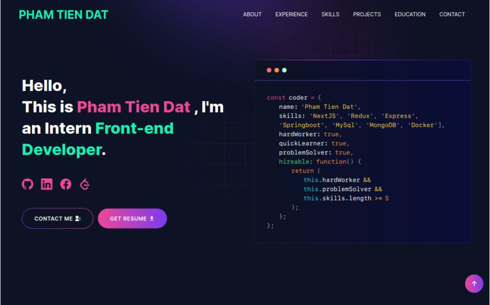

# Table of Contents :scroll:

- [Demo](#demo-movie_camera)
- [Sections](#sections-bookmark)
- [Installation](#installation-arrow_down)
- [Getting Started](#getting-started-dart)
- [Usage](#usage-joystick)
- [Packages Used](#packages-used-package)

# Demo :movie_camera:



### View live preview [here](https://my-portfolio-ptdat4823s-projects.vercel.app/).

# Sections :bookmark:

- HERO SECTION
- ABOUT ME
- EXPERIENCES
- SKILLS
- PROJECTS
- EDUCATION
- CONTACT

# Installation :arrow_down:

### You will need to download Git and Node to run this project

- [Git](https://git-scm.com/downloads)
- [Node](https://nodejs.org/en/download/)

#### Make sure you have the latest version of both Git and Node on your computer.

```
node --version
git --version
```

# Getting Started :dart:

### Fork and Clone the repo

To Fork the repo click on the fork button at the top right of the page. Once the repo is forked open your terminal and perform the following commands

```
git clone https://github.com/<YOUR GITHUB USERNAME>/developer-portfolio.git

cd developer-portfolio
```

### Install packages from the root directory

```bash
npm install
# or
yarn install
```

Then, run the development server:

```bash
npm run dev
# or
yarn dev
```

Open [http://localhost:3000](http://localhost:3000) with your browser to see the result.

# Usage :joystick:

Goto [emailjs.com](https://www.emailjs.com/) and create a new account for the mail sending. In free trial you will get 200 mail per month. After setup `emailjs` account, Please create a new `.env` file from `.env.example` file.

Ex:

```env
NEXT_PUBLIC_EMAILJS_SERVICE_ID =
NEXT_PUBLIC_EMAILJS_TEMPLATE_ID =
NEXT_PUBLIC_EMAILJS_PUBLIC_KEY =
NEXT_PUBLIC_GTM = # For site analytics
NEXT_PUBLIC_APP_URL = "http://127.0.0.1:3000"
NEXT_PUBLIC_RECAPTCHA_SECRET_KEY = # For captcha verification on contact form
NEXT_PUBLIC_RECAPTCHA_SITE_KEY =
```

### Then, Customize data in the `utils/data` [folder](https://github.com/ptdat4823/my-portfolio/blob/main/utils/data).

Ex:

```javascript
export const personalData = {
  name: "Pham Tien Dat",
  profile: "/profile.png",
  designation: "Front-end Developer",
  description:
    "My name is Pham Tien Dat. I am an enthusiastic programmer in my daily life. I am a quick learner with a self-learning attitude. I love to learn and explore new technologies and am passionate about problem-solving. I love almost all the stacks of web application development and love to make the web more open to the world. My core skill is based on TypeScript and I love to do most of the things using TypeScript. I am available for any kind of job opportunity that suits my skills and interests.",
  email: "phamtiendat4823@gmail.com",
  phone: "0868015900",
  address: "Di An City, Binh Duong Province, Viet Nam",
  github: "https://github.com/ptdat4823",
  facebook: "https://www.facebook.com/profile.php?id=100053824399338",
  linkedIn: "https://www.linkedin.com/in/dat-pham-526299252/",
  leetcode: "https://leetcode.com/u/ptdat4823/",
  devUsername: "ptdat4823",
  resume: "...",
};
```

# Packages Used :package:

| Used Package List  |
| :----------------: |
|        next        |
|  @emailjs/browser  |
|    lottie-react    |
| react-fast-marquee |
|    react-icons     |
|   react-toastify   |
|        sass        |
|    tailwindcss     |
